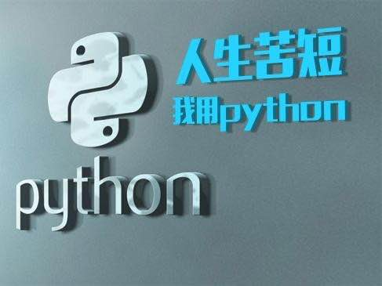
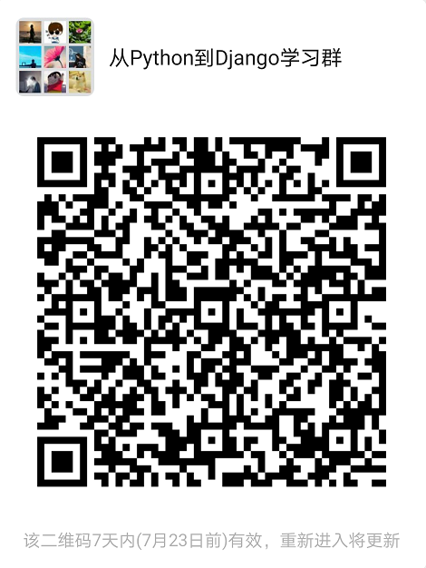

# 从Python到Django入门教程（2021版）
--------------------------------------------------

## 前言

​Python是一门面向对象的编程语言，它相对于其他语言，更加易学、易读，非常适合快速开发。Python在实践中主要有以下优点：

* 容易上手，教材众多，平台支持广泛。
* 可以很容易支持大数据的应用。
* 可以很容易的支持人工智能的应用。
* 可以很容易的迁移到IoT平台，开发物联网应用。

因此我们选择Python做为[goPyVue全栈开发网](https://borisliu.gitee.io/)的基础语言。

Django是一个开放源代码的Web应用框架，由Python写成。采用了MVC(模型M，视图V和控制器C)的软件设计模式。Django在实践中主要有以下优点：

* 在Python各种web框架中，Django的文档最完善、市场占有率最高、招聘职位最多！
* 有一个开箱即用的Admin平台，可以省去开发后台管理平台的工作。
* 有完整的开发体系，包括Web开发、REST接口开发、SQL数据库ORM、NoSQL数据库。
* ORM模型可以自动修改数据库结构，方便进行快速迭代。

因此我们选择Django作为[goPyVue全栈开发网](https://borisliu.gitee.io/)的Web应用框架。


本文是从Python到Django的入门教程，给零起点的程序员一个完整的学习路径

```
  	Python 3.7--->Django 2.2
```

## 开发环境

本文的范例基于Visual Studio Code编辑器完成的。因此，你需要准备以下这些软件：

* [VS Code](https://code.visualstudio.com/)编辑器，还需要安装Python扩展。

* [Python的安装文件](https://www.python.org/downloads/)，根据你自己的操作系统安装，一直"下一步"就能搞定。

* 用virtualenv搭建Django的开发环境，后文会详细描述。

## 开始学习

根据自己的情况选择从哪里开始学习，如果你已经有了一定的基础，你可以选择跳过某些章节，对于大多数初学者来讲，学习的路径如下：

### 1. [搭建Python开发环境](https://www.kancloud.cn/borisliu/from-python-to-django/1539197)
### 2. [简明Python教程](https://www.kancloud.cn/borisliu/from-python-to-django/1539198)
### 3. [Django Step By Step](https://www.kancloud.cn/borisliu/from-python-to-django/1539224)

---



### by <boris_cn@263.net>

更多关于Python以及Django的讨论，尤其是使用Django开发微信相关应用的技术，请使用微信扫描二维码加群。



本书托管在[GitHub](https://github.com/borisliu/from-python-to-django)，
如果有问题请在线[提交](https://github.com/borisliu/from-python-to-django/issues)。

### 废话少说，开始吧！
