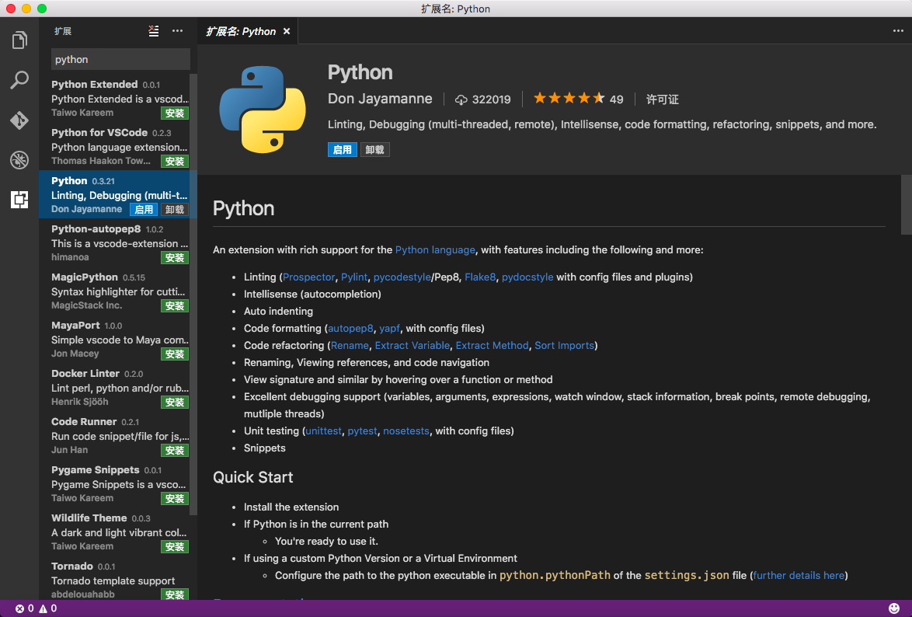
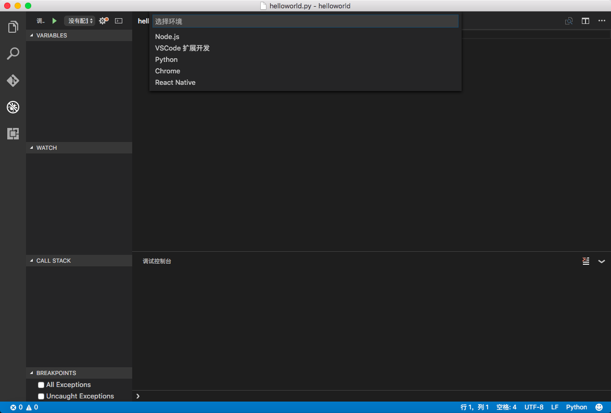
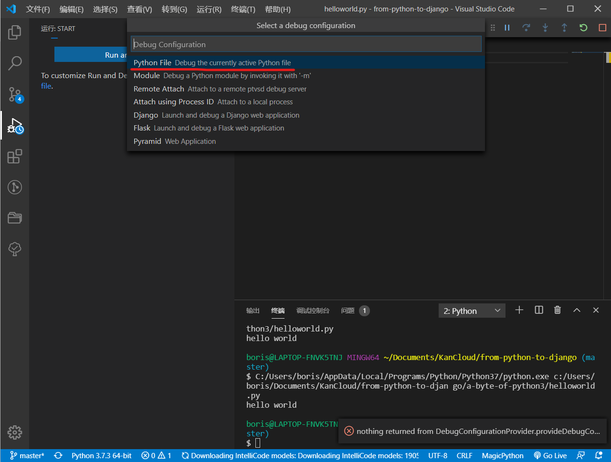
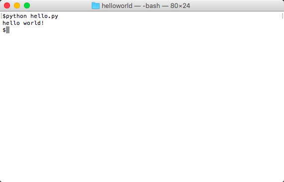

# 第一步

现在,我们将在Python中如何运行一个经典的“Hello World”程序。通过这个例子我们将会学习如何编写、保存和运行Python程序。

使用Python运行你的程序有两种方法——使用交互式解释器或使用一个源文件。下面我们通过两个例子看一下如何使用这两种方法。

## 使用交互式解释器

在操作系统中打开终端(参考[安装](./installation.md)),然后，输入`python3`并按回车键，即可打开Python 3的交互式解释器。

启动Python 3之后，会看到`>>>`，这被称为 _Python解释器提示符_。

在Python解释器提示符下，输入

```python
print("Hello World")
```

然后按回车键。我们会看到输出`Hello World`。

下面我们使用Win11电脑举个例子。不同电脑上Python软件会有一些细节的差异，但从Python解释器提示符(即`>>>`)开始，各个操作系统显示一致。

```python
C:\>python3
Python 3.9.13 (tags/v3.11.4:d2340ef, Jun  7 2023, 05:45:37) [MSC v.1934 64 bit (AMD64)] on win32
Type "help", "copyright", "credits" or "license" for more information.
>>> print("Hello World")
Hello World
>>>
```

注意，Python马上输出了代码运行的结果!刚才我们输入的是一个Python _语句_。我们使用`print`可以输出任意内容。在这里，我们提供的是字符串`Hello World`，它立刻被执行并且输出到屏幕上。

### 如何退出交互式解释器

如果你正在使用一个GNU/Linux或MaxOS的shell，您可以通过按下`[ctrl + d]`或输入`exit()`(注意:记得包含括号：`()`)，然后点击回车键。

如果您使用的是Windows命令行提示符,按`[ctrl + z]`键再按回车键，即可退出交互式解释器。

## 选择一个编辑器

我们不能在每次想要运行Python程序的时候都在解释器提示符下重新输入一遍，那样太繁琐了。我们应该把Python程序保存为Python源文件，这样我们下次想要运行的时候可以随时获取它。

要创建我们的Python源文件,我们需要一个可以输入并保存它们的编辑器。优秀的程序员会选择合适的编辑器提高编写代码的效率。因此，选择一个编辑器至关重要。选择编辑器就像选购汽车一样。一个好的编辑器会让你编写Python代码如虎添翼。就像一辆好车，在旅行中可以让你更快速、更安全、更舒适地到达目的地。

选择代码编辑器的一个非常基本的需求是 _语法高亮显示_，分别以不同的颜色显示Python程序的不同部分，以便我们可以更加直观的阅读源代码并且使代码运行可视化。

如果你不知道从哪里开始，我推荐可以在Windows、Mac OS X和GNU/Linux上使用的[Visual Studio Code](https://code.visualstudio.com/)(简称VSCode)免费软件与Python插件(ext install python)。

如果您使用的是Windows，*不要使用记事本*——这是一个糟糕的选择，因为它不做语法高亮显示，而且更重要的是它不支持代码缩进——之后我们在代码范例中会看到，缩进是非常重要的。好的编辑器会自动进行代码缩进。

如果你是一名有经验的程序员，那么你一定已经使用过[Vim](http://www.vim.org/)或[Emacs](http://www.gnu.org/software/emacs/)了。毋庸置疑，这是两个功能强大的编辑器，如果你使用它们来写Python代码，会受益颇多。就我自己而言，在我的大多数项目,甚至[使用Vim写一整本书](http://www.swaroopch.com/notes/vim)。

长期来看Vim或者Emacs是非常有用的。如果你愿意花时间去学习的话，那么我强烈建议你使用它们写Python代码。然而，正如我之前提到的，初学者可以从VSCode开始学习Python，这样可以把主要精力放在Python语言上，而不是学习编辑器的使用。

再次重申，请选择一个适当的编辑器，它可以使编写Python程序更有趣也更容易。

如果你想进一步讨论关于Python编辑器选择的问题，可以参考[选择一个最好的Python代码编辑器](https://realpython.com/courses/finding-perfect-python-code-editor/)

## VSCode（原文推荐[PyCharm教育版](https://www.jetbrains.com/pycharm-edu/)，考虑到这个版本功能不完整，完整功能的专业版要收费，本文推荐VSCode）

[Visual Studio Code](https://code.visualstudio.com/)是一个免费的集成开发环境（IDE），你可以用它开发Python程序。

下载安装之后，在菜单中选择`查看`->`扩展`，然后输入`python extension pack`，安装下面两个扩展：

* 由`Don Jayamanne`开发的`Python Extension Pack`
* 由`Microsoft`开发的`Chinese (Simplified) Language Pack`



就完成了开发环境的配置

在VSCode中，项目就是文件夹，你可以使用资源管理器新建一个文件夹，然后在VSCode中使用菜单项`文件`->`打开文件夹...`打开这个文件夹。

打开文件夹之后，使用菜单项`文件`->`新建文件`创建一个新的文件，VSCode默认会给文件起名`Untitled-1`，选择`文件`->`保存`将文件保存在当前项目文件夹下面，命名为`helloworld.py`，就完成了第一个Python源文件的创建。

在编辑器中输入以下代码：

```python
print("hello world!")
```

点击`[Ctrl+S]`保存文件之后，点击右上角的三角图标，就可以运行`helloworld.py`程序了，可以看到`hello world!`的输出。



上面的运行方式只可以运行单个Python源文件，不能进行调试。为了调试我们需要为Python项目创建一个`launch.json`文件，使用菜单项`查看`->`运行`，点击`create a launch.json file`，然后在弹出的对话框里选择`Python File`，就可以创建一个`launch.json`文件。有了这个文件，在右上角的三角图标右侧的下拉菜单中选择`调试`，就可以调试我们的Python程序，注意要保持helloworld.py是当前打开的文件状态。



## Vim

1. 安装[Vim](http://www.vim.org)
    * Mac OS X用户应该通过[HomeBrew](https://brew.sh/index_zh-cn)安装`macvim`软件。
    * Windows用户应该在[Vim网站](https://www.vim.org/download.php)下载exe安装文件。
    * GNU/Linux用户一般情况下可以直接使用`vim`。
2. 你可以安装[jedi-vim](https://github.com/davidhalter/jedi-vim)这个插件为vim增加自动完成的功能。
3. 安装对应的`jedi`python包 : `pip install -U jedi`

## Emacs

1. 安装[Emacs 24+](https://www.gnu.org/software/emacs/).
    * Mac OS X用户从[https://emacsformacosx.com/](https://emacsformacosx.com/)获得emacs
    * Windows用户从[https://ftp.gnu.org/gnu/emacs/windows/](https://ftp.gnu.org/gnu/emacs/windows/)下载
    * GNU/Linux用户根据不同的发行版获得对应的emacs软件，比如Debian和Ubuntu用户可以安装`emacs24`软件包
2. 安装[ELPY](https://elpy.readthedocs.io/en/latest/)

## Using A Source File

现在让我们回归正题-编程。每当你学习一门新的编程语言时，有一个传统，你编写和运行的第一个程序是“Hello World”程序。当你运行它时，它所做的只是输出“Hello World”。正如Simon Cozens(神奇的"Beginning Perl"的作者)所说，这是“向编程神祈求帮你更好学习语言的传统咒语。”

打开你选择的编辑器，输入以下程序并将其保存为`hello.py`。

如果你使用VSCode编辑器，点击`文件`->`新建文件`，输入:

```python
print('Hello World')
```

在VSCode编辑器，选`文件`->`保存`保存文件。

Python文件可以保存在哪里？你电脑中的任意文件夹都可以。如果你还不清楚，你可以创建一个新文件夹，并使用这个文件夹保存和运行你所有的Python程序:

- `C:\py` 在Windows上
- `/tmp/py` 在Mac OS X上
- `/tmp/py` 在GNU/Linux上

使用`mkdir`命令创建一个文件夹，例如，`mkdir C:\py`。

重要提示：确保你的Python文件扩展名是`.py`，例如，`foo.py`。

运行你的Python程序:

1. 打开一个命令行窗口。
2. **进入**你刚才保存文件的目录，例如：`cd C:\py`。
3. 键入`python hello.py`运行python程序，输入如下：

```shell
C:\py> python hello.py
Hello World
```



如果你得到了如上所示的输出结果，那么祝贺你!你已经成功地运行了你的第一个Python程序。您已经成功地跨越了学习编程最难的部分－－开始你的第一个程序!

如果报错了，请 _准确_ 输入上面的程序，并且再次运行。注意，Python是区分大小写的，即`print`并不等于`Print`。前者是小写字母`p`和后者是大写字母`P`。同样，确保每一行的第一个字母之前没有空格或制表符——之后我们将继续阐述为[什么这很重要](./basics.md)。

**它是如何工作的**

Python程序是由 _语句_ 组成，在我们的第一个程序中，我们只有一个语句，在这个语句中，我们使用了`print` _函数_，它只是输出文本`Hello World`。

## 获得帮助

如果您需要快速获取任何Python函数或语句的信息，可以使用内置的`help`(帮助)功能。这是非常有用的，尤其是当使用命令行提示符时，例如，运行`help(len)`——这将显示`len`函数的帮助－－用于计算对象包含了多少元素。

提示：按`q`退出帮助

类似地,您可以获取Python中几乎所有事情的帮助，可以尝试使用`help()`去学习更多关于使用`help`本身的帮助!

如果你需要获取操作符例如`return`的帮助，那么你只需要把它放到引号里，如`help('return')`，Python就可以清楚的了解我们想要获取的帮助。

## 总结

现在，你可以自由自在地编写、保存和运行Python程序了。

既然你是一名Python程序猿，在下一章我们要学习一些Python的基本概念。

---

