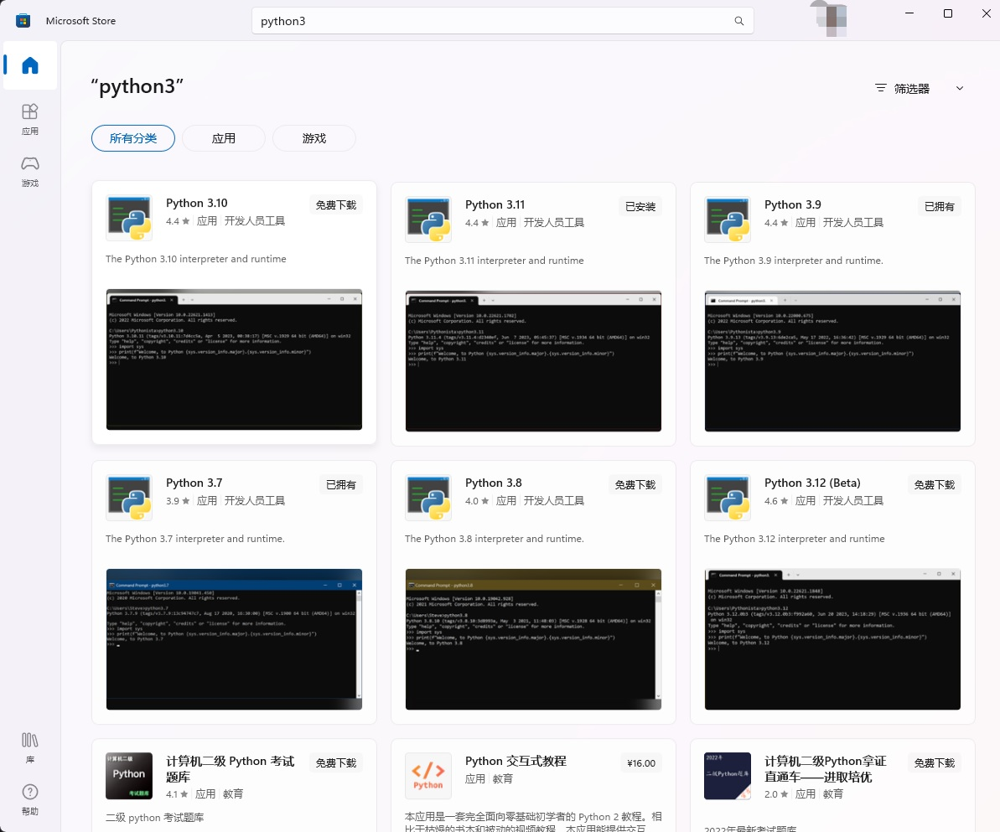

# 安装

本书所描述的"Python 3"，指的是[Python 3.10](https://www.python.org/downloads/)或更高的版本。

## 在Windows 10 或 11上安装

在`Microsoft Store`应用商店中搜索`python3`，可以看到不同版本的`Python 3`软件，选择一个高于`Python 3.10`的安装即可，参见下图：



如果你已经完成安装，可以跳过剩余内容直接阅读下一章节。

## 在Windows上安装


访问[[https://www.python.org/downloads/](https://www.python.org/downloads/)下载最新版本，在撰写本文时，最新版为3.11.4，我们以此为范例进行安装。安装过程和其它基于Windows的软件类似。

如果你的Windows版本比Vista更老，你只能下载[Python 3.4版本](https://www.python.org/downloads/windows/)，因为更高版本的Python需要更高版本的Windows。

注意
> 在安装过程中，一定要勾选`Add Python 3.11 to PATH`

如果想要修改安装路径，点击`Customize installation`, 再点击`Next`，键入`C:\Python311`(或者其他路径)作为新的安装路径。

如果在安装的时候没有勾选`Add Python 3.11 to PATH`，可以在安装中勾选`Add Python to environment variables`. 这和`Add Python 3.11 to PATH`效果相同。

你可以为所有用户安装Python Launcher，不安装也没关系。Launcher用来在不同的Python版本之间进行切换。

如果你的安装路径没有设置正确（勾选`Add Python 3.11 to PATH`或者`Add Python to environment variables`），参考下一个章节（`DOS提示符`）的步骤来修正。否则，请参考本章的`在Windows命令行上运行Python`。

提示: 对于有经验的程序员，如果你对Docker比较熟悉，请参考[Python in Docker](https://hub.docker.com/_/python/) 和 [Docker on Windows](https://docs.docker.com/windows/).

### DOS提示符

If you want to be able to use Python from the Windows command line i.e. the DOS prompt, then you need to set the PATH variable appropriately.
如果你想要在Windows命名行（例如DOS提示符）使用Python，你需要正确设置PATH变量。

对于Windows 2000、XP、2003，点击`控制面板` -> `系统` -> `高级` -> `环境变量`。在 _系统变量_ 中点击`PATH`，选择`编辑`，然后在已有内容的最后部分添加`;C:\Python311`（请核实存在该文件夹，对于新版本Python来说，文件夹的名字可能不同）。要注意使用正确的目录名。

对于早期版本的Windows，打开`C:\AUTOEXEC.BAT`文件，添加一行`PATH=%PATH%;C:\Python311`，然后重启系统。对于Windows NT，使用AUTOEXEC.NT文件。

对于Windows Vista

* 点击“开始”，选择`控制面板`。
* 点击“系统”，在右侧您将看到“查看计算机基本信息”。
* 左侧是一个任务列表，点击最后一项`高级系统设置`。
* 显示`系统属性`对话框`高级`选项卡。点击右下角的`环境变量`按钮。
* 在下方标题为`系统变量`框中，滚动`Path`，点击`编辑`按钮。
* 按需修改路径。
* 重启操作系统。Vista只有重启才会使系统路径变量的修改生效。

对于Windows 7/8:

* 在桌面上右键单击`我的电脑`，选择`属性`；或点击`开始` -> `控制面板` -> `系统和安全` -> `系统`，点击左侧的`高级系统设置`，然后选择`高级`选项卡。点击底部的`环境变量`按钮，在下方的`系统变量`中找到`PATH`变量，选中它点击`编辑`。
* 在变量值的最后，追加`;C:\Python311`（请确认是这个路径，新版的Python可能会有所不同）。
* 如果这个值是`%SystemRoot%\system32`;，它将变成%`SystemRoot%\system32;C:\Python311`。
* 点击`确定`完成。不需要重启，只要重新打开Windows命令行就可以。

对于Windows 10:

Windows开始菜单 > `设置` > `关于` > `系统` > `高级系统设置` > `环境变量` （通常在底部） > (点击上半部分的`Path`变量然后点击`编辑`) > `新建` > (输入Python安装路径，例如`C:\Python311\`)

### 在Windows命令行上运行Python

对于Windows用户，如果正确地设置了PATH变量，你可以在命名行运行Python。

要打开Windows终端，点击开始按钮，点击`运行`。在对话框输入`cmd`，按下回车键。

然后输入`python`即可，注意不要有拼写错误。

## 在Mac OS X上安装

对于Mac OS X用户，使用[Homebrew](https://brew.sh/index_zh-cn)命令：`brew install python3`安装。

To verify, open the terminal by pressing `[Command + Space]` keys (to open Spotlight search), type `Terminal` and press `[enter]` key. Now, run `python3` and ensure there are no errors.
想要验证Python 3是否已经正确安装，使用`[Command + Space]`键打开终端（打开Spotlight搜索），输入`Terminal`然后回车。之后，运行`python3`，注意不要有拼写错误。

## 在GNU/Linux上安装

对于GNU/Linux用户，使用你的Linux发行版的包管理器来安装Python 3，如果你使用的是Debian & Ubuntu: `sudo apt-get update && sudo apt-get install python3`。

想要验证Python 3是否已经正确安装，打开`Terminal`应用程序，或者按下`Alt + F2`然后输入`gnome-terminal`。如果不成功，请参考你所用Linux发行版的文档。然后再命令行运行`python3`命令，注意不要有拼写错误。

运行下面的命令，可以输出Python的版本：

```shell
$ python3 -V
Python 3.11.4
```

提示：`$`是shell的提示符，根据你电脑上的操作系统设置会有所不同，这里我简单的使用`$`符号表示。

注意：输出的版本信息在你的电脑上可能会有所不同，这取决于你安装的Python版本。

## 总结

从现在起，我们假定你已经在自己的电脑上安装好了Python。

接下来，我们将开始编写我们的第一个Python程序。