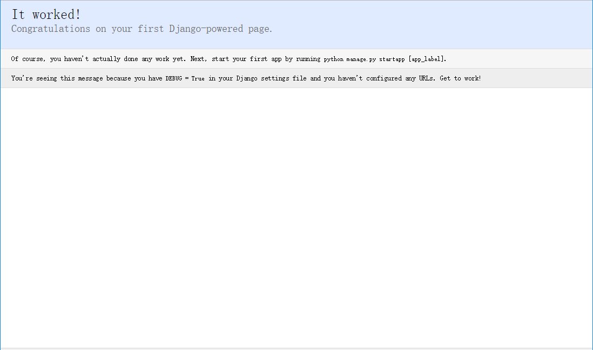

# Django Step by Step (一)

## 1   开篇

Django 是新近出来的 Rails 方式的 web 开发框架。在接触 Django 之前我接触过其它几种 Python 下的 web framework, 但感觉 Karrigell 是最容易上手的。不过 Django 从我个人的感觉上来看，它的功能更强大，社区也很活跃，高手众多，发展也是极为迅速。我个人很看好。但在学习的过程中感觉与 Karrigell 的开发体验差距比较大。那么我想，Karrigell 与 Django 的开发体验到底差别在哪里，为什么 Django 给我的感觉还不是那么清晰直观呢？

我想可能是因为 Django 的教程过于想把它的特色展示给大家，因此，对于初学者来说一下子接触的东西太多，反倒让大家很难理解。于是我想从最最简单的例子做起，并且记录下来，并且将其形成一个教程。

## 2   Karrigell的入门体验

不知道大家是否了解 Karrigell ，它是一个优秀的 web framework 框架，在发现它之后我写了不少关于代码分析的文章。因为它开发方式非常灵活，特别是方便，对它的印象也非常好。只不过开发 web 不是我的主业，因此实践得少。不过 Zoom.Quiet 在这方面已经有所建树，大家可以去 wiki 上学习他写的 “问卷调查生成系统”的快速体验教程 。这是一个非常详细的过程，而且还有图。

那么为什么 Karrigell 开发让人感觉到方便呢？我想来想去可能有这些原因：

现在的开发，特别是 Python 的开发，我们都喜欢而且习惯边学边做，从小做起，一边做一边看效果。因此从小入手，步步有体验，这就是 Python 开发的特点。我们不会一上来就写出非常大的东西，而是写一点，运行一下，调试一下，再写一点，运行一下，调试一下，慢慢地积少成多。这种方式非常典型，也更为大多数人习惯。而 Karrigell 则基本上就是这样的。安装完 Karrigell ，然后就可以运行了。不用写程序，写个简单的 html 页面，直接放在它的webapps目录下(这是2.2版，如果你没有修改karrigell.ini的root参数的缺省目录)，在浏览器就可以看了。就这么简单。写程序也简单呀，写个hello.py，里面就是:

```python
    print "Hello, Karrigell!"
```

这就是最简单的web体验。从这里入手后，你就可以一点点地开始学习其它的web知识了。积少成多。 Karrigell 真是就是这样。

## 3   Django的入门体验

但 Django 呢？如果说最简单的web体验 Hello, Django! 如何写呢？决不会象 Karrigell 那样简单，只从它提供的教程来看，你无法在安装后非常 Easy 地写出一个 Hello, Django! 的例子，因为有一系列的安装和准备工作要做。那么下面我把我所尝试写最简单的 Hello, Django! 的例子写出来。

> 请注意，我测试时是在 Windows环境下进行的。

### 3.1   安装

```
    C:\>pip install django
```

### 3.2   生成项目目录

因为 Karrigell 可以直接开发，因此放在哪里都可以。而 Django 是一个框架，它有特殊的配置要求，因此一般不需要手工创建目录之类的工作， Django 提供了 django-admin.py 可以做这件事。

```
    C:\>django-admin startproject newtest
```

这样就在当前目录下创建了一个 newtest 目录，进去入可以看到这样的目录结构：

```
    newtest/
        manage.py
        newtest/
            __init__.py
            settings.py
            urls.py
            wsgi.py
```

这个 newtest 将是我们以后工作的目录，许多讲解都是基于这个目录的。

> 最外层的newtest/目录包括了项目的全部文件，这个目录名可以随意修改。
>
> manage.py：
> 提供简单化的 django-admin.py 命令，特别是可以自动进行 DJANGO_SETTINGS_MODULES 和 PYTHONPATH 的处理，而没有这个命令，处理上面环境变量是件麻烦的事情 
>
> newtest/子目录是项目实际运行所依赖的Python包。目录名就是Python包名，如果需要导入子目录的模块就需要使用这个名字(例如mysite.urls)。
> 
> newtest/__init__.py： 
> 表示这是一个 Python 的包 
>
> newtest/settings.py：
> 它是django的配置文件 
>
> newtest/uls.py：
> url映射处理文件， Karrigell 没有这种机制，它通过目录/文件/方法来自动对应，而 Django 的url映射是url对于某个模块方法的映射，目前不能自动完成
>
> newtest/wsgi.py：
> 如果需要将项目部署到兼容WSGI的Web服务器上，这个文件就是入口。

虽然 django-admin.py 为我们生成了许多东西， 而且这些东西在以后的开发中你都需要熟悉，但现在我们的目标是最简单的体验，就认为我们不需要知道它们都有什么用吧。

项目创建好了，那么我们可以启动服务器吗？ Django 为了开发方便，自带了一个用于开发的 web server。

### 3.3   启动 web server

别急呀，还没看见 Hello, Django! 在哪里呢。是的，我只是想看一看， Django 能否启动。

```
    C:\newtest\>python manage.py runserver
``` 

一旦出现:

```
Performing system checks...

System check identified no issues (0 silenced).

You have unapplied migrations; your app may not work properly until they are applied.
Run 'python manage.py migrate' to apply them.

November 25, 2016 - 15:50:53
Django version 1.10, using settings 'mysite.settings'
Starting development server at http://127.0.0.1:8000/
Quit the server with CONTROL-C.
```

说明 Django 真的启来了。在浏览器中看一下，有一个祝贺页面，说明成功了。



### 3.4   增加一个helloworld的app吗？

在 Django 中绝大多数应用都是以app形式存在的，但一定要加吗？其实并不需要。在 Django 中，每个app就是一个子包，真正调用时需要通过 URL Dispatch 来实现url与模块方法的映射。这是 Django 的一大特色，但也是有些麻烦的地方。不用它，你无法发布一个功能，如果在 Django 中存在一种缺省的简单映射的方式，这样我想可以大大提高 Django 的入门体验度。

因此根据 URL Dispatch 的机制，我们只要保证 Django 可以在正确的地方找到方法进行调用即可。那么我们就根本不去创建一个app了。

在 newtest子目录下创建一个文件 helloworld.py 内容为:

```python
from django.http import HttpResponse

def index(request):
    return HttpResponse("Hello, Django.")
```

### 3.5   修改urls.py

```python
from django.conf.urls import url
from django.contrib import admin
from . import helloworld

urlpatterns = [
    url(r'^admin/', admin.site.urls),
    url(r'^$', helloworld.index),
]
```

好了。保存了。上面的 r'^$' 是为了匹配空串，也就是形如: http://localhost:8000/ 。如果这时 web server 已经启动了，那么直接刷新页面就行了。

现在觉得 Django 是不是简单多了，除了创建一个项目的操作，然后可能要修改两个配置文件，其它还都简单吧。

## 4   结论

Django 本身的确是一种松散的框架组合，它既复杂又简单。复杂是因为如果你想使用它的自动化的、高级的功能你需要学习很多的东西，而且它的教程一上来就是以这种过于完整的例子进行展示，自然会让你觉得很麻烦。不过看了我的讲解之后，是不是觉得还是挺简单的。那么我们就先以无数据库的方式进行下去，一点点地发掘 Django 的功能特性吧。

回过头来再细想一想，之所以认为 Karrigell 简单而 Django 复杂，主要在于 Karrigell 的教程适合我们这种由浅入深，循序渐近的方式，而 Django 虽然也可以这样，但它的教程却没有做成这样，因此让我们茫然。当然到最后，在我们熟练之后我们不再会有这样的感觉，毕竟这只是入门的体验，但就是这种体验可能会吓走许多的人呢。
