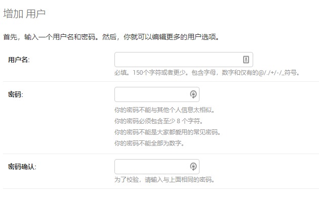
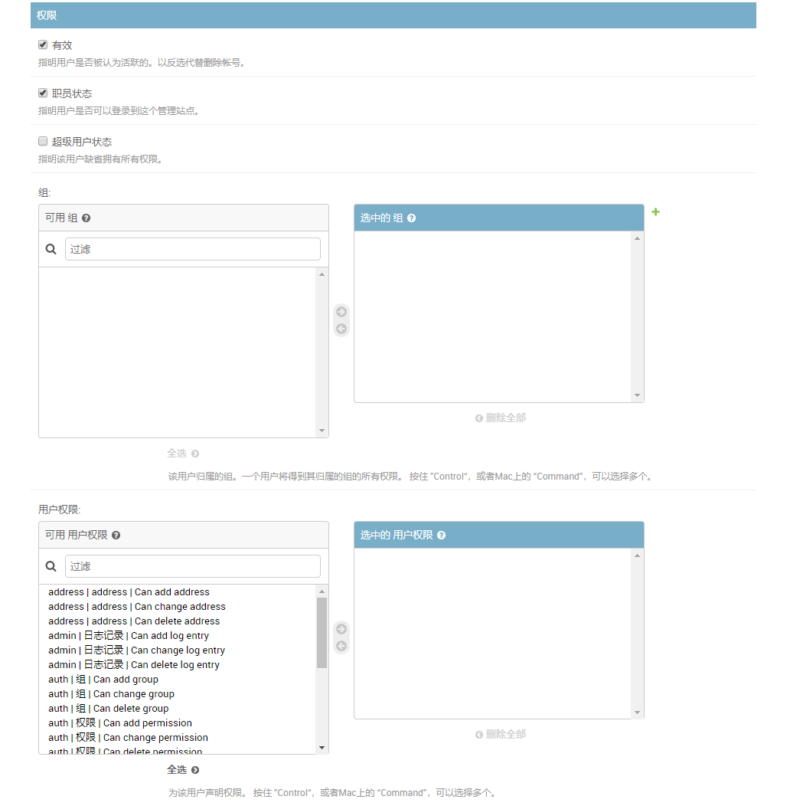

# Django Step by Step (十一)

## 1 引言

让我们再仔细看一下这个通讯录，我们知道，如果想增加新的记录，一种方法是通过 admin 界面，这个已经由 [Django](https://www.djangoproject.com/) 自动为我们做好了。我们还可以批量导入，这个是我们实现的。但是这里有风险，为什么？如果什么人都可以导入这可是件不好的事，那么怎么办： **加权限控制** 。

Django 自带了一个权限控制系统，那么我们就用它。因此先让我们简单地了解一下 Django 中的权限。同时我希望只有特殊权限的人才可以做这件事情，在前几讲中我们一直使用超级用户，但这并不是个好的习惯。因此让我们先创建个个人用户吧。

## 2 添加一个个人用户

使用 admin 用户进入管理界面 [http://localhost:8000/admin]()

在 Auth 下有用户一项，点击添加按钮进入添加界面，还挺复杂的。在这里提示是黑体的字段是必输项，其实只有两项是需要我们输的：用户名和密码。用户名好办，密码有一些复杂度的要求：



- 你的密码不能与其他个人信息太相似。
- 你的密码必须包含至少 8 个字符。
- 你的密码不能是大家都爱用的常见密码。
- 你的密码不能全部为数字。

知道了密码的要求之后，那么我们只要填入用户名，密码就行了。



> 注意，职员状态检查框如果不打勾，则你的用户也无法使用，因为他不能登录。也许你担心，如果打勾了，那不是他就能做好多事了吗？其实不然。在 Django 中，创建一个 app 之后都有一些基本的权限会自动生成，而这些除了超级用户，它们是不会自动赋给某个用户的。因此如果管理员不给某个用户关于 app 的使用权限，那么这个用户根本没有办法操纵这些 app ，甚至连看都看不到(大家自已试一下就知道了)。这样他能够做的只是登录，但这也许就够了，有时我们需要的就是一个用户的合法身份，而不是一定要他能做些什么。

`request` 对象提供一个 `user` 对象，你可以根据它来判断当前用户的身份，所属的组，所拥有的权限。我们可以在 view 代码中进行用户身份的检查。

现在我的想法是：限制特殊用户来做这件事。首先我可以在 `settings.py` 中设定这个用户名，然后在 view 中检查当前用户是否是 `settings.py` 中设定的用户。

## 3 修改 newtest/settings.py

在最后增加:

```python
UPLOAD_USER = 'limodou'
```

> 这里请把 limodou 改成你想要的名字。要注意，在后面的测试中你需要按这里指定的名字创建一个用户。

## 4 修改 address/views.py

```python
#...
from django.conf import settings

@csrf_exempt
def upload(request):
    if request.user.username != settings.UPLOAD_USER:
        return render_to_response('address/error.html',
            {'message':'你需要使用 %s 来登录！' % settings.UPLOAD_USER})
#...
```

我们从 django.conf 导出了 settings ，然后在 `upload()` 中判断当前用户名是否是等于 `settings.UPLOAD_USER` 这个用户名，如果不是则提示出错信息。否则继续处理。

好象一切都挺简单，但这里还有一个大问题：能不能自动导向一个用户注册的页面去呢？上面的处理是需要用户进入 admin 管理界面进行注册后，再进行操作。如果没有注册就上传文件，则只会报错。这里我希望实现：如果用户没有注册过，自动显示一个注册页面。如何做呢？

文档中提出了一个方法:

```python
from django.contrib.auth.decorators import login_required

@login_required
def my_view(request):
    ...
```

这个方法我试过了，但失败了。主要的原因是：如果你还没有注册，它会自动导向 /accounts/login/ ，而这个URL目前是不存在的。在我分析了 login.py 代码之后，我认为它只是一个框架，并不存在 Django 已经提供好的模板可以直接使用，如果要使用它是不是需要我自已去建一个可以用的模板？没办法，我分析了 admin 的代码之后，最终找到了一种替代的方法:

```python
from django.contrib.admin.views.decorators import staff_member_required

@staff_member_required
def upload(request):
```

admin 已经提供了这样的一个方法： `staff_member_required` 。它允许我使用 admin 的登录画面。

一旦把上面的代码补充完整，代码是这样的:

```python
from .models import Address

from django.http import HttpResponseRedirect
from django.shortcuts import render_to_response
from django.views.decorators.csrf import csrf_exempt
from django.conf import settings
from django.contrib.admin.views.decorators import staff_member_required

@staff_member_required
@csrf_exempt
def upload(request):
    if request.user.username != settings.UPLOAD_USER:
        return render_to_response('address/error.html',
            {'message':'你需要使用 %s 来登录！' % settings.UPLOAD_USER})
    file_obj = request.FILES.get('file', None)
    if file_obj:
        import csv
        from io import StringIO
        try:
            csvfile = StringIO(file_obj.read().decode())
            reader = csv.reader(csvfile)
        except:
            return render_to_response('address/error.html',
                {'message':'你需要上传一个csv格式的文件！'})
        for row in reader:
            objs = Address.objects.filter(name=row[0])
            if not objs:
                obj = Address(name=row[0], gender=row[1],
                    telphone=row[2], mobile=row[3], room=row[4])
            else:
                obj = objs[0]
                obj.gender = row[1]
                obj.telphone = row[2]
                obj.mobile = row[3]
                obj.room = row[4]
            obj.save()

        return HttpResponseRedirect('/address/')
    else:
        return render_to_response('address/error.html',
            {'message':'你需要上传一个文件！'})

from django.http import HttpResponse
from django.template import loader, Context

def output(request):
    response = HttpResponse(content_type='text/csv')
    response['Content-Disposition'] = 'attachment; filename=%s' % 'address.csv'
    t = loader.get_template('address/csv.html')
    objs = Address.objects.all()
    d = []
    for o in objs:
        d.append((o.name, o.gender, o.telphone, o.mobile, o.room))
    c = {'data': d,}
    response.write(t.render(c))
    return response
```

基本没有变化，主要是开始的一些地方增加了用户权限的处理。

## 5 启动 server 测试

在点击上传之后，如果没有注册会进入登录画面。如果已经注册，但用户名不对，则提示一个出错信息。不过，一旦注册出错，没有提供自动重新登录的功能，因此你需要进入 admin 管理地址，然后注销当前用户，再重新上传或先用正确的用户登录。因为是个简单的 app ，没必要做得那么完善。同时还存在的一个问题是，如果你没有注册过，那么点击上传按钮后，将进入登录画面，但如果成功，你上传的文件将失效，需要重新再上传。那么解决这个问题的一个好方法就是：不要直接显示上传的东西，而是先提供一个链接或按钮，认证通过后，再提供上传的页面，这样可能更好一些。

在 [User authentication in Django](https://docs.djangoproject.com/en/2.0/topics/auth/) 文档中还有许多的内容，如权限，在模板中如何使用与认证相关的变量，用户消息等内容。
