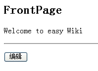

# Django Step by Step (六)

## 1 引言

以后的例子可能会越来越复杂，没办法因为我们用的东西越来越复杂，同时我们的能力也在增长。

下面我们按照 [TurboGears](http://www.turbogears.org) 的 [Wiki in 20 Minutes](http://turbogears.readthedocs.io/en/latest/turbogears/wiki20.html) 的例子仿照一个，我们要用 [Django](https://www.djangoproject.com/) 来做 wiki。我不会按 TurboGears 的操作去做，只是实现一个我认为的最简单的 wiki。

现在我的要求是：

>做一个简单的wiki，要可以修改当前页面，即在页面下面提供一个编辑的按钮。然后还要识别页面中的两个开头大写的单词为页面切换点，可以进入一个已经生成好的页面，或提示创建一个新页面。

下面我们将开始创建 Django 中的 app 了。

先说一下。如果你看过官方版的教程，它就是讲述了一个 Poll 的 app 的生成过程。那么一个 app 就是一个功能的集合，它有自已的 model ，view 和相应的模板，还可以带自已的 urls.py 。那么它也是一个独立的目录，这样一个 app 就可以独立地进行安装，你可以把它安装到其它的 Django 服务器中去。因此采用 app 的组织形式非常有意义。而且 `adango-admin.py` 也提供了一个针对 app 的命令，一会我们就会看到。而且 Django 提供一些自动功能也完全是针对于 app 这种结构的。Model, Template, View 就合成了 MTV 这几个字母。 Model 是用来针对数据库，同时它可以用来自动生成管理界面， View 在前面我们一直都用它，用来处理请求和响应的相当于MVC框架中的 Controller 的作用， Template 用来生成界面。

## 2 创建 wiki app

```Shell
python manage.py startapp wiki
```


这样在 wiki 子目录下有以下文件:

* __init__.py 
表示 wiki 目录是一个包。 

* views.py 
用来放它的 view 的代码。 
    
* models.py 
用来放 model 代码。 

* apps.py
用来放配置代码

* admin.py
用来配置当前的wiki如何使用Django Admin功能

* tests.py
用来放测试代码

* migrations目录
用来放每一次数据库变化后需要对数据库做的变化

## 3 编辑 wiki/models.py

```Python
from django.db import models

# Create your models here.
class Wiki(models.Model):
    pagename = models.CharField(max_length=20, unique=True)
    content = models.TextField()
```

每个 model 其实在 Django 中就是一个表，你将用它来保存数据。在实际的应用中，一般都要与数据库打交道，如果你不想用数据库，那么原因可能就是操作数据库麻烦，创建数据库环境也麻烦。但通过 Django 的 model 处理，它是一种 ORM (Object Relation Mapping, 对象与关系的映射)，可以屏蔽掉底层数据库的细节，同时提供以对象的形式来处理数据。非常方便。而且 Django 的 model 层支持多种数据库，如果你改变数据库也不是什么问题，这也为以后的数据库迁移带来好处。总之，好处多多，大家多多体会吧。

Wiki 是 model 的名字，它需要从 models.Model 派生而来。它定义了两个字段，一个是字段是 pagename ， 用来保存 wiki 页面的名字，它有两个参数，一个是最大长度(不过从这点上不如 [SQLAlchemy](http://www.sqlalchemy.org/) 方便, SQLAlchemy并不需要长度，它会根据有无长度自动转为 TEXT 类型)，目前 CharField 需要这个参数；另一个是 unique 表示这个字段不能有重复值。还有一个字段是 content ，用来保存 wiki 页面的内容，它是一个 TextField 类型，它不需要最大长度。

现在不太了解 model 没有关系，关键是看整个生成过程。

一旦你定义好了 model ，在运行时， Django 会自动地为这个 model 增加许多数据操作的方法。关于 model 和 数据库操作API的详细内容参见 [Model reference](https://docs.djangoproject.com/en/1.10/ref/models/) 和 [Database API reference](https://docs.djangoproject.com/en/1.10/ref/databases/) 的文档。

## 4 修改 settings.py, 安装 app

虽然我们的其它工作没有做完，但我还是想先安装一下 app 吧。每个一 app 都需要安装一下。安装一般有两步：

### 4.1 修改settings.py

```Python 
INSTALLED_APPS = [
    'django.contrib.admin',
    'django.contrib.auth',
    'django.contrib.contenttypes',
    'django.contrib.sessions',
    'django.contrib.messages',
    'django.contrib.staticfiles',
    'newtest',
    'wiki.apps.WikiConfig',
]
```

这个在文件的最后，django开头的是缺省定义的。给出指定 wiki 包的引用名来。这一步是为了以后方便地导入所必须的。因为我们的目录都是包的形式，因此这里就是与目录相对应的。

### 4.2 执行(在newtest目录下) 

```Shell
python manage.py makemigrations
python manage.py migrate
```

如果没有报错就是成功了。这一步 Django 将根据 model 的信息在数据库中创建相应的表。表就是这样创建出来的。

## 5 在命令行下加入首页(FrontPage)

我们假设首页的名字为 FrontPage ，并且我们将在命令行下增加它，让我们熟悉一下命令行的使用

进入 newtest 目录，然后:

```Shell
python manage.py shell
```

进入 python

```Python
>>> from wiki.models import Wiki
>>> page = Wiki(pagename='FrontPage', content='Welcome to Easy Wiki')
>>> page.save()
>>> Wiki.objects.all()
[<Wiki object>]
>>> p = Wiki.objects.all()[0]
>>> p.pagename
'FrontPage'
>>> p.content
'Welcome to Easy Wiki'
```

在 Django 中，对于数据库的记录有两种操纵方式，一种是集合方式，一种是对象方式。集合方式相当于表级操作，可以使用 model.objects 来处理。 objects 对象有一些集合方式的操作，如 all() 会返回全部记录， filter() 会根据条件返回部分记录。而象插入新记录则需要使用记录方式来操作，些时要直接使用 model 类。

## 6   修改 wiki/views.py

```Python
from .models import Wiki
from django.template import loader, Context
from django.http import HttpResponse, HttpResponseRedirect
from django.shortcuts import render_to_response
from django.views.decorators.csrf import csrf_exempt

def index(request, pagename=""):
    """显示正常页面，对页面的文字做特殊的链接处理"""
    if pagename:
        #查找是否已经存在页面
#        pages = Wiki.objects.get_list(pagename__exact=pagename)
        pages = Wiki.objects.filter(pagename=pagename)
        if pages:
            #存在则调用页面模板进行显示
            return process('wiki/page.html', pages[0])
        else:
            #不存在则进入编辑画面
            return render_to_response('wiki/edit.html', {'pagename':pagename})

    else:
#        page = Wiki.objects.get_object(pagename__exact='FrontPage')
        page = Wiki.objects.get(pagename='FrontPage')
        return process('wiki/page.html', page)

@csrf_exempt
def edit(request, pagename):
    """显示编辑存在页面"""
#    page = Wiki.objects.get_object(pagename__exact=pagename)
    page = Wiki.objects.get(pagename=pagename)
    return render_to_response('wiki/edit.html', {'pagename':pagename, 'content':page.content})

@csrf_exempt
def save(request, pagename):
    """保存页面内容，老页面进行内容替换，新页面生成新记录"""
    content = request.POST['content']
#    pages = Wiki.objects.get_list(pagename__exact=pagename)
    pages = Wiki.objects.filter(pagename=pagename)
    if pages:
        pages[0].content = content
        pages[0].save()
    else:
        page = Wiki(pagename=pagename, content=content)
        page.save()
    return HttpResponseRedirect("/%s" % pagename)

import re

r = re.compile(r'\b(([A-Z]+[a-z]+){2,})\b')
def process(template, page):
    """处理页面链接，并且将回车符转为<br>"""
    t = loader.get_template(template)
    content = r.sub(r'<a href="/\1">\1</a>', page.content)
    content = re.sub(r'[\n\r]+', '<br>', content)
    c = {'pagename':page.pagename, 'content':content}
    return HttpResponse(t.render(c))
```

代码有些长，有些地方已经有说明和注释了。简单说一下：

* `index()` 用来显示一个 wiki 页面。它需要一个参数就是页面的名称。如果在数据库中找得到，则调用 `process()` 方法(`process()` 方法是一个自定义方法，主要用来对页面的文本进行处理，比如查找是否有满足 wiki 命名规则的单词，如果有则替换成链接。再有就是将回车转为 `<br>` )。如果没有找到，则直接调用编辑模板显示一个编程页面。当然，这个页面的内容是空的。只是它的页面名字就是 `pagename` 。如果 `pagename` 为空，则进入 `FrontPage` 页面。 `Wiki.objects` 对象有 `filter()` 方法和 `get()` 方法，一个返回一个结果集，一个返回指定的对象。这里为什么使用 `filter()` 呢，因为一旦指定文件不存在，它并不是返回一个 `None` 对象，而是抛出异常，而我没有使用异常的处理方式。通过 `filter()` 如果存在则结果中应有一个元素，如果不存在则应该是一个 `[]` 。这样就知道是否有返回了。 

**Note**

>filter() 中使用的参数与一般的 db-api 是一样的，但如果是比较相等，可以为: pagename__exact=pagename 也可以简化为 pagename=pagename 。

**Note**

>在 Django 中，一些字段的比较操作比较特殊，它是在字段名后加 __ 然后是比较条件。这样看上去就是一个字符串。具体的参见 The Database API 。

**Note**

>回车转换的工作其实可以在模板中使用 filter 来完成。

* 在上一章我们将所有的模板都放在了`newtest/templates`目录下，从本章开始，为了区分方便，我们会针对每一个app创建`templates/app`的子目录，将模板文件(edit.html)放在app目录下统一管理。由于Django针对TEMPLATES的默认的设置有`'APP_DIRS': True`，会自动到每一个app的`templates`目录下寻找模板文件。

因为我们在设计 model 时已经设置了 pagename 必须是唯一的，因此一旦 filter() 有返回值，那它只能有一个元素，而 pages[0] 就是我们想要的对象。

* page = wikis.get(pagename='FrontPage')

    是表示取出 pagename 为 FrontPage 的页面。你可能要说，为什么没有异常保护，是的，这也就是为什么我们要在前面先要插条记录在里面的原因。这样就不会出错了。再加上我要做的 wiki 不提供删除功能，因此不用担心会出现异常。

* `edit()` 用来显示一个编辑页面，它直接取出一个页面对象，然后调用 wiki/edit.html 模板进行显示。也许你还是要问，为什么不考虑异常，因为这里不会出现。为什么？因为 edit() 只用在已经存在的页面上，它将用于存在页面的修改。而对于不存在的页面是在 index() 中直接调用模板来处理，并没有直接使用这个 edit() 来处理。也许你认为这样可能不好，但由于在 edit() 要重新检索数据库，而在 index() 已经检索过一次了，没有必要再次检索，因此象我这样处理也没什么不好，效率可能要高一些。当然这只是个人意见。

* save() 用来在编辑页面时用来保存内容的。它先检查页面是否在数据库中存在，如果不存在则创建一个新的对象，并且保存。注意，在 Django 中，对对象处理之后只有调用它的 save() 方法才可以真正保存到数据库中去。如果页面已经存在，则更新页面的内容。处理之后再重定向到 index() 去显示这个页面。

## 7   在 wiki 中创建 templates 子目录

## 8   编辑 wiki/templates/wiki/page.html

```html
<h2>{{ pagename }}</h2>
<p>{{ content }}</p>
<hr/>
<p>
<form method="POST" action="/wiki/{{ pagename }}/edit/">
<input type="submit" value="编辑">
</form></p>
```

它用来显示页面，同时提供一个“编辑”按钮。当点击这个按钮时将调用 view 中的 edit() 方法。

## 9   编辑 wiki/templates/wiki/edit.html

```html
<h2>编辑:{{ pagename }}</h2>
<form method="POST" action="/wiki/{{pagename}}/save/">
<textarea name="content" rows="10" cols="50">{{ content }}</textarea><br/>
<input type="submit" value="保存">
</form>
```

它用来显示一个编辑页面，同时提供“保存”按钮。点击了保存按钮之后，会调用 view 中的 save() 方法。

## 10   修改 urls.py

```Python
from django.conf.urls import include, url
from django.contrib import admin
from . import helloworld, add, list, xls_test, login

urlpatterns = [
    url(r'^admin/', admin.site.urls),
    url(r'^$', helloworld.index),
    url(r'^add/$', add.index),
    url(r'^list/$', list.index),
    url(r'^xls/(?P<filename>\w+)/$', xls_test.output),
    url(r'^login/$', login.login),
    url(r'^logout/$', login.logout),
    url(r'^wiki/', include('wiki.urls')),
]
```

在wiki目录下增加一个urls.py的文件，然后编辑内容增加了 wiki 等4个 url 映射。

```Python
from django.conf.urls import url

from . import views

urlpatterns = [
    url(r'^$', views.index),
    url(r'^(?P<pagename>\w+)/$', views.index),
    url(r'^(?P<pagename>\w+)/edit/$', views.edit),
    url(r'^(?P<pagename>\w+)/save/$', views.save),
]
```

这里要好好讲一讲 URL 的设计(个人所见)。

一般一个 wiki ，我们访问它的一个页面可能为：wiki/pagename。因此我设计对 index() 方法的调用的 url 为:

```Python
r'^wiki/(?P<pagename>\w+)/$'
```

也就是把 wiki/后面的解析出来作为 `pagename` 参数。但这样就带来一个问题，如果我想实现 `wiki/edit.html` 表示修改， `pagename` 作为一个参数通过 POST 来提交好象就不行了。因为上面的解析规则会“吃”掉这种情况。因此我采用 [Zope](http://www.zope.org) 的表示方法：把对象的方法放在对象的后面。我可以把 `pagename` 看成为一个对象， `edit` , `save` 是它的方法，放在它的后面，也简单，也清晰。当然如果我们加强上面的正则表达式，也可以解析出 `wiki/edit.html` 的情况，但那就是你设计的问题了。这里就是我的设计。

因此 wiki/pagename 就是显示一个页面，wiki/pagename/edit 就是编辑这个页面， wiki/pagename/save 就是保存页面。而 `pagename` 解析出来后就是分别与 `index()` , `edit()` , `save()` 的 `pagename` 参数相对应。

下面你可以运行了。

11   启动 server
进入 (http://localhost:8000/wiki)

首先进入这个页面：



然后你点编辑，则进入FrontPage的编辑界面：


然后我们加上一个 TestPage ，它符合 wiki 的名字要求，两个首字母大写的单词连在一起。然后点击保存。


看见了吧。页面上的 TestPage 有了链接。点击它将进入：


这是 TestPage 的编辑页面。让我们输入中文，然后输入 FrontPage 。然后保存。


好了，剩下的你来玩吧。点击 FrontPage 将回到首页。
