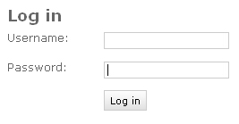
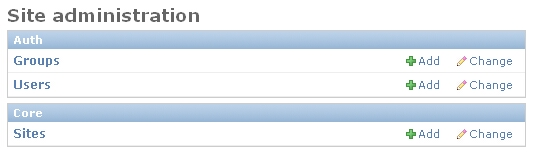
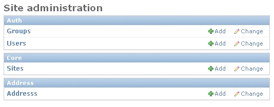
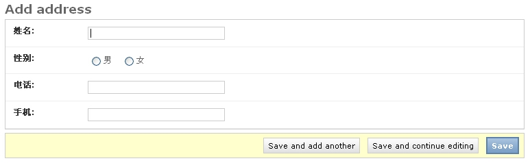
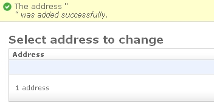
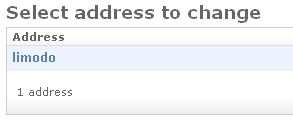

# Django Step by Step (七)

## 1 引言

敢问路在何方，路在脚本。如果你坚持下来，一定会有收获的。

直到目前我们已经学了：

* settings.py的设置 
* url dispatcher 
* 模板 
* session 
* app 
* model 

其实在某些方面，使用 Django 还可以更加方便。而且我们还有许多东西没有学，一点点跟着我学吧。

我有一个通讯录，它是保存在 Excel 文件中的，我不想每次到目录下去打开它，我希望用 Django 做一个web上的简单应用，如何做呢？

## 2 创建 address app

```shell
python manage.py startapp address
```

这样就创建好了 address 相关的目录了。

## 3 修改 address/models.py

```python
from django.db import models

# Create your models here.

class Address(models.Model):
    name = models.CharField('姓名', max_length=6, unique=True)
    gender = models.CharField('性别', choices=(('M', '男'), ('F', '女')),
        max_length=1)
    telphone = models.CharField('电话', max_length=20)
    mobile = models.CharField('手机', max_length=11)
```

这回 model 复杂多了。在上面你可以看到我定义了四个字段： name , gender , telpnone , mobile 。其中 gender 表示性别，它可以从一个 tuple 数据中进行选取。并且在后面的 radio_admin=True 表示在 admin 的管理界面中将使用 radio 按钮来处理。

**Note**

>Django 提供了许多的字段类型，有些字段类型从数据的取值范围来讲没有什么区别，但之所以有这种区别，是因为：Django 的数据类型不仅仅用于创建数据库，进行 ORM 处理，还用于 admin 的处理。一方面将用来对应不同的 UI 控件，另一方面提供对不同的数据类型将进行不同的数据校验的功能。

在 Django 中每个字段都可以有一个提示文本，它是第一个参数，如果没有则会使用字段名。因此我定义的每个字段为了方便都有一个对应的汉字提示文本。

因为本节主要是讲 admin 的使用。admin 是 Django 提供的一个核心 app(既然是 app 就需要安装，一会就看到了)，它可以根据你的 model 来自动生成管理界面。我为什么要用它，因为有了这个管理界面，对于通讯录的增加、删除、修改的处理界面完全可以通过 admin 来自动生成，我不用自已写。不相信吗？我们就会看到了。

那么 admin 到底可以带来些什么好处呢？它的功能很强大，不仅界面漂亮，还能对数据提供操作记录，提供搜索。特别是它是在用户权限控制之下，你都可以不用考虑安全的东西了。并且它本身就是一个非常好的学习的东西，特别是界面自动生成方面，学习它的代码可以用在我们自已的定制之中。当然，你许你用不上 admin ，它的确有一定的适应范围，不过对于大部分工作来说它可能足够了。对于那些交互性强的功能，你可能要自已实现许多东西，对于管理集中，主要以发布为主的东西，使用它可以节省你大量的时间。至于怎么使用，你要自已去权衡。但这一点对于快速实现一个 web 应用，作用非常大，这是 Django 中的一个亮点。

## 4 修改 settings.py

```python
INSTALLED_APPS = (
    'django.contrib.admin',
    'django.contrib.auth',
    'django.contrib.contenttypes',
    'django.contrib.sessions',
    'django.contrib.messages',
    'django.contrib.staticfiles',
    'newtest',
    'wiki.apps.WikiConfig',
    'address.apps.AddressConfig',
)
```

这里我们加入了Address的app ，我们注意到系统默认就已经添加了admin的应用，就是django.contrib.admin 。 admin 也是一个应用，需要加入INSTALLED_APPS才可以使用，这些与标准的app的安装没有什么不同。

## 5 安装 address app

```shell
python manage.py makemigrations
python manage.py migrate
```

这样将在数据库中创建 address 相关的表。

## 6 增加超级用户

进入 (http://localhost:8000/admin)



进入看一看吧。咦，要用户。对，admin 功能是有用户权限管理的，因此一个 admin 替你完成了大量的工作：用户的管理和信息的增加、删除、修改这类功能类似，开发繁琐的东西。那么我们目前还没有一个用户，因此可以在命令下创建一个超级用户，有了这个用户，以后就可以直接在 admin 界面中去管理了。

```shell
python manage.py createsuperuser
```

它会让你输入用户名，邮件地址和口令。

这回再进去看一下吧。



上面已经有一些东西了，其中就有用户管理。但如何通过 admin 增加通讯录呢？别急，我们需要编辑一下address/admin.py，告诉admin应用我们的Address对象可以被admin管理。

**Note**

>因此是否启用 admin 管理取决于你。只要在 address/admin.py 中增加 admin 相关的部分，我们的应用才可以在 admin 中被管理。

## 7 修改 address/admin.py

```python
from django.contrib import admin

# Register your models here.

from .models import Address

admin.site.register(Address)
```

有了这个东西，你就可以在 admin 中看到 adress 这个 app 了。再到浏览器中看一下是什么样子了。



看见了吧。上面有增加和删除的按钮，先让我们点击一下增加吧。



这个自动生成的界面是不是很不错。增加一条保存起来了。不过我发现当我输入 `limodou` 时，只能输入 `limodo` 好象 `u` 输不进去。为什么？因为我把姓名按汉字算最多6个就够了，一旦我使用英文的名字可能就不够。因此这是一个问题，一会要改掉。



怎么新增的记录叫 <Address object> 这样看上去很别扭。为什么会这样，因为没有定义特殊的方法。下面就让我们定义一下。

## 8 修改 address/models.py

```python
from django.db import models

# Create your models here.

class Address(models.Model):
    name = models.CharField('姓名', max_length=6, unique=True)
    gender = models.CharField('性别', choices=(('M', '男'), ('F', '女')),
        max_length=1)
    telphone = models.CharField('电话', max_length=20)
    mobile = models.CharField('手机', max_length=11)

    def __str__(self):
        return self.name
```

改好了，再刷新下页面。这次看见了吗？增加了一个 __str__ 方法。这个方法将在显示 Address 实例的时候起作用。我们就使用某个联系人的姓名就行了。



你记得吗？Model 是与数据库中的表对应的，为什么我们改了 model 代码，不需要重新对数据库进行处理呢？因为只要不涉及到表结构的调整是不用对表进行特殊处理的。不过，我们马上要修改表结构了。

## 9 修改 address/models.py

姓名留短了真是不方便，另外我突然发现需要再增加一个房间字段。

```python
from django.db import models

# Create your models here.

class Address(models.Model):
    name = models.CharField('姓名', max_length=20, unique=True)
    gender = models.CharField('性别', choices=(('M', '男'), ('F', '女')),
        max_length=1)
    telphone = models.CharField('电话', max_length=20)
    mobile = models.CharField('手机', max_length=11)
    room = models.CharField('房间', max_length=10, default='')

    def __str__(self):
        return self.name
```

这回表结构要改变了，怎么做呢？

## 10 修改表结构

我们可以使用Django提供的数据迁移功能，在不影响原有数据的情况下，更新表结构。主要包括下面的命令：

* migrate，负责应用迁移，以及取消应用并列出其状态。
* makemigrations, 负责基于你的模型修改创建一个新的迁移
* sqlmigrate, 展示迁移的sql语句

大家一定已经注意到了，我们增加的字段`room`多了一个默认值空字符串，这是为了在增加一个新的字段中之后，可以使用这个默认值填充已有的记录。下面我们创建一个新的迁移

```shell
python manage.py makemigrations
```

然后我们就在address/migrations目录下得到了一个新的`0002_auto_XXXXXXXX_XXXX.py`的文件，这个文件由Django自动生成，用于迁移数据库使用，我们不用管它，使用下面的命令执行迁移：

```shell
python manage.py migrate
```

现在数据库中已经是新的表结构了，我们可以对数据继续进行操作。

## 11 进入 admin

我们可以再次进入 admin 了，增加，删除，修改数据了。

用了一会，也许你会希望：能不能有汉化版本的界面呢？答案是肯定的，而且已做好了。

## 12 修改 settings.py

在`MIDDLEWARE`部分，增加`django.middleware.locale.LocaleMiddleware`，代码如下：

```python
MIDDLEWARE = [
    'django.middleware.security.SecurityMiddleware',
    'django.contrib.sessions.middleware.SessionMiddleware',
    'django.middleware.common.CommonMiddleware',
    'django.middleware.csrf.CsrfViewMiddleware',
    'django.contrib.auth.middleware.AuthenticationMiddleware',
    'django.contrib.messages.middleware.MessageMiddleware',
    'django.middleware.clickjacking.XFrameOptionsMiddleware',
    'django.middleware.locale.LocaleMiddleware',
]
```

刷新下界面，是不是变成汉字了。

国际化支持在 Django 中做得是非常的出色，程序可以国际化，模板可以国际化，甚至js都可以国际化。这一点其它的类似框架都还做不到。而国际化的支持更是 RoR 的一个弱项，甚至在 [Snakes and Rubies](http://snakesandrubies.com/event) 的会议上，RoR 的作者都不想支持国际化。但 Django 却做得非常出色，目前已经有二十多种语言译文。

在增加，删除，修改都做完了，其实还剩下什么呢？显示和查询。那么实现它则需要写 view 和使用模板了。这个其实也没什么，最简单的，从数据库里查询出所有的数据，然后调用模板，通过循环一条条地显示。不错是简单。但是在做之前，先让我们想一想，这种处理是不是最常见的处理方法呢？也许我们换成其它的应用也是相似的处理。如果很多这样的处理，是不是我们需要每次都做一遍呢？有没有通用的方便的方法。答案是：有！ Django 已经为我们想到了，这就是 [Generic views](https://docs.djangoproject.com/en/1.11/topics/class-based-views/generic-display/) 所做的。它把最常见的显示列表，显示详细信息，增加，修改，删除对象这些处理都已经做好了一个通用的方法，一旦有类似的处理，可以直接使用，不用再重新开发了。但在配置上有特殊的要求。具体的可以看 Generic views 文档。

从这里我有一点想法，我认为 view 这个名称特别容易让人产生误解，为什么呢？因为 view 可以译为视图，给人一种与展示有关的什么东西。但实际上 Django 中的 view 相当于一个 Controller 的作用，它是用来收集数据，调用模板，真正的显示是在模板中处理的。因此我倒认为使用 Controller 可能更合适，这样就称为 MTC 了。呵呵，只是个人想法。

另外， Generic views 产生的意义在于 Django 的哲学理含 DRY (Don't repeat yourself, 不要自已重复)，目的是重用，减少重复劳动。还有其它的哲学理含参见 [Design philosophies](https://docs.djangoproject.com/en/1.11/misc/design-philosophies/) 文档。

因此可以知道 view 可以极大地简化， Django 在这点上认为：每个应用的显示都可能是不同的，因此这件事需要用户来处理。但如果有最简单的封装，对于开发人员在测试时会更方便，但目前没有，因此模板我们还是要准备，而且还有特殊的要求，一会就看到了。

对于目前我这个简单的应用来说，我只需要一个简单的列表显示功能即可，好在联系人的信息并不多可以在一行显示下。因此我要使用 `django.views.generic` 模块来处理。

## 13   增加 address/urls.py

对，我们为 address 应用增加了自已的 urls.py。

```python
from django.conf.urls import url

from . import views

urlpatterns = [
    url(r'^$', views.IndexView.as_view(), name='index'),
]
```

我们使用`as_view`这个generic view的方法显示默认的列表界面，可以大大的简化views.py的编码工作，现在我们的views.py代码如下：

```python
from django.views import generic

from .models import Address

class IndexView(generic.ListView):
    model = Address
    template_name = 'index.html'
```

我们只需要从`generic.ListView`继承，并创建一个基于类的View，命名为`IndexView`，然后为这个类设置两个成员变量，一个为`model = Address`，指定我们的generic view需要显示哪一个模型的数据；再设置`template_name = 'index.html'`，指定显示的模板。

前面已经谈到：使用 generic view 只是减少了 view 的代码量，但对于模板仍然是必不可少的。因此要创建符合 generic view 要求的模板。主要是模板存放的位置和模板文件的名字。

缺省需要的模板文件名为： `app_label/model_name_list.html` ，在这个模板中可以使用 `object_list`变量访问模型的列表 。

## 14   在 address 中创建 templates 子目录

## 15   创建 address/templates/address_list.html

```html
<h1>通讯录</h1>
<hr>
<table border="1">
<tr>
  <th>姓名</th>
  <th>性别</th>
  <th>电话</th>
  <th>手机</th>
  <th>房间</th>
</tr>

<tr>
  <td>{{ person.name }}</td>
  <td>{{ person.gender }}</td>
  <td>{{ person.telphone }}</td>
  <td>{{ person.mobile }}</td>
  <td>{{ person.room }}</td>
</tr>

</table>
```

## 16 修改 urls.py

将我们的应用的 urls.py include 进去。

```python
from django.conf.urls import include, url
from django.contrib import admin
from . import helloworld, add, list, xls_test, login

urlpatterns = [
    url(r'^admin/', admin.site.urls),
    url(r'^$', helloworld.index),
    url(r'^add/$', add.index),
    url(r'^list/$', list.index),
    url(r'^xls/(?P<filename>\w+)/$', xls_test.output),
    url(r'^login/$', login.login),
    url(r'^logout/$', login.logout),
    url(r'^wiki/', include('wiki.urls')),
    url(r'^address/', include('address.urls')),
]
```

可以看到 `r'^address/'` 没有使用 `$` ，因为它只匹配前部分，后面的留给 address 中的 `urls.py` 来处理。

## 17 启动 server 看效果

