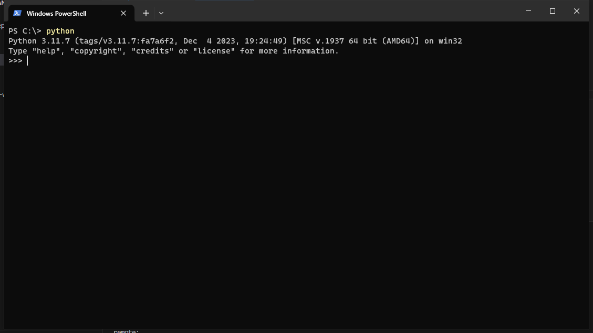

# 搭建Python开发环境
---

## 选择哪个版本

当前Python最高版本是3.12.x，Django最高版本是5.0.x。

Python和Django的版本号，都遵循[语义化版本规范](https://semver.org/lang/zh-CN/)，也就是`主版本号.次版本号.修订号`

本文选择的Python版本是3.11.x，Django版本是5.0.x（LTS版本）。

## 安装Python 3.11.x

对于 Python 的初学者，建议从 Microsoft Store 安装 Python。

转到“开始” 菜单（左下方 Windows 图标），输入“Microsoft Store”，选择用于打开应用商店的链接。

应用商店打开后，从右上方菜单中选择“搜索”，然后输入“Python”。 在“应用”下，从结果中选择要使用的 Python 3.11 版本。 确定要安装的版本后，请选择“获取”。

Python 完成下载和安装过程后，使用“开始”菜单（左下方 Windows 图标）打开 Windows PowerShell。 PowerShell 打开后，输入 `python --version` 以确认已在计算机上安装了 Python3。

```shell
PS C:\> python --version
Python 3.11.7
PS C:\>
```
Python 的 Microsoft Store 安装包括 pip（标准包管理器）。 通过 pip 可以安装和管理不属于 Python 标准库的其他包。 若要确认还可使用 pip 安装和管理包，请输入 `pip --version`。

```shell
PS C:\> pip --version
pip 23.2.1 from C:\Program Files\WindowsApps\PythonSoftwareFoundation.Python.3.11_3.11.2032.0_x64__qbz5n2kfra8p0\Lib\site-packages\pip (python 3.11)
PS C:\>
```

在PowerShell中输入`python`，然后就进入到Python交互模式，它的提示符是`>>>`

如果你看到下面的提示，那么说明你已经安装成功了。



Python环境搭好之后我们写下第一行代码，输出一个"hello world!"：

```python
    print('hello world!')
```

你会看到在终端输出了`hello world!`的字符串


恭喜你，完成安装！

## 安装virtualenv

Python程序在运行过程中可能会使用到很多第三方的包(package)。

每个Python程序使用的第三方包都不太一样，那么我们需要为每一个Python程序创建一个独立的Python运行环境。

virtualenv就是用来为每一个Python程序创建一套“隔离”的Python运行环境。virtualenv可以建立多个独立的虚拟环境，各个环境中拥有自己的python解释器和各自的package包，互不影响。Python 3.11已经自带了virtualenv。


用`python -m venv .venv`就可以创建一个名为`.venv`的虚拟环境了，进入这个虚拟环境后，再使用pip install安装其它的package就只会安装到这个虚拟环境里，不会影响其它虚拟环境或系统环境。

接下来我们要用这个工具创建我们自己的开发环境。

## 安装Django 5.0.x

为了能够使用Django的命令行，我们把Django安装到Windows系统的环境中，在命令行模式中输入：

```shell
    C:\>pip instal django -i https://pypi.tuna.tsinghua.edu.cn/simple
```
就可以完成安装。其中`-i https://pypi.tuna.tsinghua.edu.cn/simple`是安装源，可以替换成你喜欢的其他源，比如豆瓣源：`-i https://pypi.doubanio.com/simple`


## 创建第一个Django项目

为了能够统一地管理Django项目的代码等信息，我们将代码和virtualenv环境都放在同一个目录中，这样无论这个目录拷贝到哪里，都可以直接加载环境之后开始运行，首先输入下面的命令创建第一个django项目：

```shell
    C:\>django-admin startproject helloworld
    C:\>cd helloworld
```

然后我们在helloworld目录下面创建一个venv的目录，作为这个Django项目的虚拟环境，之后我们在这个虚拟环境中安装Django

```shell
    C:\helloworld\>python -m venv .venv
    C:\helloworld\>.\.venv\scripts\activate
    (.venv) C:\helloworld\>pip install django -i https://pypi.tuna.tsinghua.edu.cn/simple
```

这个时候你应该可以看到提示符前面增加了“(.venv)”的字样，如下所示：


这个命令行模式就已经处于`.venv`这个虚拟的Python环境下面了，如果你再输入`python`命令的时候，就会使用这个虚拟环境下面的Python。请注意，下面的教程我们都是在这个环境下面运行的。

下面让我们运行一下我们的第一个Django项目。如果你处于Python交互模式，使用`exit()`命令可以退出到命令行模式。在命令行模式下面输入：

```shell
    (.venv) C:\helloworld\>python manage.py runserver
```

然后我们使用浏览器打开这个地址[http://localhost:8000/](http://localhost:8000/)就可以看到一个欢迎页面了。


在命令行下面使用`Ctrl+C`可以退出这个Django项目。

## 安装Visual Studio Code作为Python IDE

访问<https://code.visualstudio.com>下载Visual Studio Code（简称VS Code）客户端，然后安装。打开后会看到如下的界面。


点击箭头所指的`扩展`按钮，输入`@popular`，就会显示最流行的扩展清单，选择Python扩展进行安装。


由于我们的virtualenv目录会放到Python项目的venv子目录下，所以我们要对Python扩展进行一点设置。在VS Code菜单中选择“文件”->“首选项”->“用户设置”，就会打开用户设置的文件`settings.json`，输入如下信息指定我们的Python环境路径：

```
{
    "python.pythonPath": "${workspaceRoot}/.venv/scripts/python.exe",
}
```

## 使用VS Code打开helloworld

在helloworld目录下输入：

```
    (venv) C:\helloworld\>code .
```

即可使用VS Code打开helloworld项目。VS Code没有项目描述文件，一个目录就是一个项目，后面的例子我们都用这个开发工具完成。

## 完结！ 

--------------------------------------------------

### 继续阅读[简明Python教程](../a-byte-of-python3/index.md)