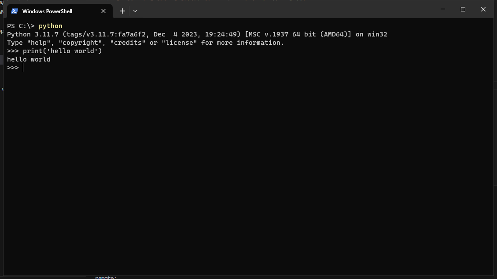

# 搭建Python开发环境
---

## 选择哪个版本

当前Python最高版本是3.8.x，Django最高版本是3.0.x。

通常情况下，最新版本的前一个小版本号的程序是比较稳定的，而且也添加了绝大部分的最新特性，因此本文选择的Python版本是3.7.x，Django版本是2.2.x。

## 安装Python 3.7.x

Win10下面安装Python的开发环境，需要到[https://www.python.org/downloads/](https://www.python.org/downloads/)下载对应的Python安装包，安装的时候勾选上修改PATH的选项，然后完成安装就是了。本文使用的是Python 3.7.3。

在Windows开始菜单选择“命令提示符”，就进入到命令行模式，它的提示符类似`C:\>`，之后输入

```shell
    C:\>python
```

就看到类似如下的一堆文本输出，然后就进入到Python交互模式，它的提示符是`>>>`

如果你看到下面的提示，那么说明你已经安装成功了。


Python环境搭好之后我们写下第一行代码，输出一个"Hello world!"：

```python
    print('hello world!')
```

你会看到在终端输出了`hello world!`的字符串



恭喜你，完成安装！

## 安装virtualenv

Python程序在运行过程中可能会使用到很多第三方的包(package)，如果你的电脑上有很多个Python的程序，而每个程序依赖的第三方包又都不太一样，那么我们需要为每一个Python程序创建一个独立的Python运行环境。

virtualenv就是用来为每一个Python程序创建一套“隔离”的Python运行环境。virtualenv可以建立多个独立的虚拟环境，各个环境中拥有自己的python解释器和各自的package包，互不影响。

使用Python自带的pip工具可以很方便的安装、卸载和管理Python的包。

首先使用

```python
    exit()
```

命令退出Python交互模式，进入命令行模式，之后输入

```shell
    pip install virtualenv
```

就完成了virtualenv工具的安装。

pip和virtualenv可以很好的协同工作，同时使用这两个工具非常方便。

用virtualenv env1就可以创建一个名为env1的虚拟环境了，进入这个虚拟环境后，再使用pip install安装其它的package就只会安装到这个虚拟环境里，不会影响其它虚拟环境或系统环境。

接下来我们要用这个工具创建我们自己的开发环境。

## 安装Django 2.2.x

为了能够使用Django的命令行，我们把Django安装到系统的环境中，在命令行模式中输入：

```shell
    C:\>pip instal django==2.2.11
```

就可以完成安装。

## 创建第一个Django项目

为了能够统一地管理Django项目的代码等信息，我们将代码和virtualenv环境都放在同一个目录中，这样无论这个目录拷贝到哪里，都可以直接加载环境之后开始运行，首先输入下面的命令创建第一个django项目：

```
    C:\>django-admin startproject helloworld
    C:\>cd helloworld
```

然后我们在helloworld目录下面创建一个venv的目录，作为这个Django项目的虚拟环境，之后我们在这个虚拟环境中安装Django

```
    C:\helloworld\>virtualenv venv
    C:\helloworld\>venv\scripts\activate
    (venv) C:\helloworld\>pip install django
    (venv) C:\helloworld\>
```

这个时候你应该可以看到提示符前面增加了“(venv)”的字样，如下所示：


这个命令行模式就已经处于`venv`这个虚拟的Python环境下面了，如果你再输入`python`命令的时候，就会使用这个虚拟环境下面的Python。请注意，下面的教程我们都是在这个环境下面运行的。

下面让我们运行一下我们的第一个Django项目。如果你处于Python交互模式，使用`exit()`命令可以退出到命令行模式。在命令行模式下面输入：

```
    (venv) C:\helloworld\>python manage.py runserver
```

然后我们使用浏览器打开这个地址[http://localhost:8000/](http://localhost:8000/)就可以看到一个欢迎页面了。


在命令行下面使用`Ctrl+C`可以退出这个Django项目。

## 安装Visual Studio Code作为Python IDE

访问<https://code.visualstudio.com>下载Visual Studio Code（简称VS Code）客户端，然后安装。打开后会看到如下的界面。


点击箭头所指的`扩展`按钮，输入`@popular`，就会显示最流行的扩展清单，选择Python扩展进行安装。


由于我们的virtualenv目录会放到Python项目的venv子目录下，所以我们要对Python扩展进行一点设置。在VS Code菜单中选择“文件”->“首选项”->“用户设置”，就会打开用户设置的文件`settings.json`，输入如下信息指定我们的Python环境路径：

```
{
    "python.pythonPath": "${workspaceRoot}/venv/scripts/python.exe",
}
```

## 使用VS Code打开helloworld

在helloworld目录下输入：

```
    (venv) C:\helloworld\>code .
```

即可使用VS Code打开helloworld项目。VS Code没有项目描述文件，一个目录就是一个项目，后面的例子我们都用这个开发工具完成。

## 完结！ 

--------------------------------------------------

### 继续阅读[简明Python教程](../a-byte-of-python3/index.md)